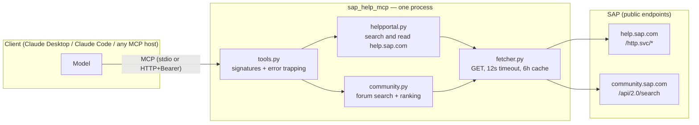
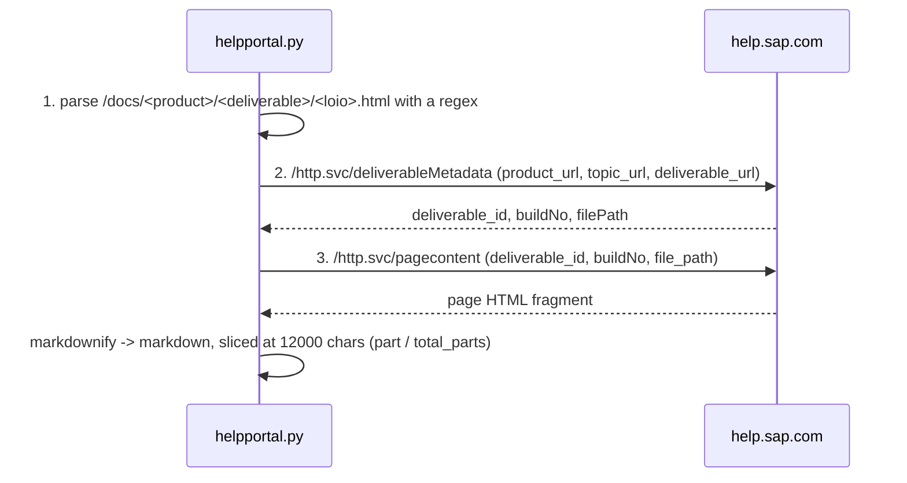
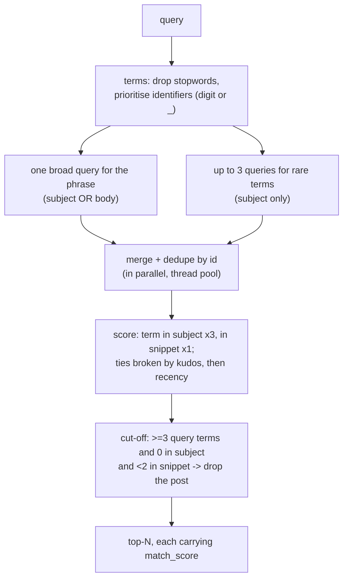

# How sap-help-mcp works

Technical notes for whoever opens this project for the first time — or comes back to
it in six months.

## The shape of it

One Python process, four tools, two external sources, zero state on disk. The server
stores nothing and knows no secrets; it translates MCP tool calls into HTTP requests
against public SAP endpoints and reshapes the answers into something a model can use.



Files:

```
sap-help-mcp/
├── src/sap_help_mcp/
│   ├── server.py        entry point: FastMCP, instructions, transport, bearer auth
│   ├── tools.py         the four tool declarations (model-facing text, limits)
│   ├── helpportal.py    help.sap.com: search + the three-step page read
│   ├── community.py     Community: multi-pass search + our own ranking
│   ├── fetcher.py       the only place HTTP happens
│   └── probe.py         live source check without MCP (CLI)
├── tests/test_smoke.py  offline tests (request shapes, ranking, assembly)
├── manifest.json        MCPB bundle descriptor (server type `uv`)
└── docs/                this file
```

The layers do not leak into each other: `tools.py` knows nothing about HTTP,
`helpportal.py` and `community.py` know nothing about MCP, and `fetcher.py` does not
know who it serves. That is why the logic can be exercised from plain Python, which is
exactly what the tests do.

## sap_help_search: searching help.sap.com

One GET against the portal's search facade:

```
GET https://help.sap.com/http.svc/elasticsearch
    ?q=<query>&area=content&language=en-US
    &state=PRODUCTION,TEST,DRAFT
    &transtype=standard,html          ← readable types only: a PDF in the result list
    &product=<filter>&version=<pin>     is noise, it cannot be opened via pagecontent
    &to=<limit-1>&advancedSearch=0&excludeNotSearchable=1
```

The endpoint is not publicly documented — the request shape was derived from
[mcp-sap-docs](https://github.com/marianfoo/mcp-sap-docs) (Apache 2.0, see NOTICE) and
verified live. The portal does the ranking; the only levers on our side are the
`product` and `version` filters.

One fact worth knowing: the portal indexes the `SUPPORT_CONTENT` space — the support
Expert Content wiki (FAQs, troubleshooting guides). That is precisely why this server
carries no local mirror of that wiki: the online search returns the same pages, and it
covers every space rather than whichever subset somebody once crawled.

## sap_help_read: reading a page

The full text does not come back in one request. The portal hands it over in three
steps:



Step 1 is local parsing of the `ref` (the URL from the search results). Steps 2 and 3
hit the network and are both cached. A failure at any step comes back as
`{"error", "step"}` — the `step` field says exactly where it broke.

## sap_community_search: searching the forum

The Khoros API accepts LiQL, an SQL-like language over a `messages` table that holds
everything — blogs, Q&A, discussions:

```
SELECT id, subject, search_snippet, post_time, view_href, kudos.sum(weight)
FROM messages
WHERE (subject MATCHES '<query>' OR body MATCHES '<query>')   -- broad pass
  AND depth = 0 LIMIT <n>                                     -- top-level posts only
```

(The rare-term passes use `subject MATCHES` alone.)

Two properties of that API mean a single query is not enough (both caught live):

1. `MATCHES` treats a multi-word query as **OR over the words**;
2. results are **not ranked** — newest first, and that is all.

The naive query "foreign currency valuation FAGL_FCV" therefore returned yesterday's
posts containing the word *currency*, while the posts about FAGL_FCV never surfaced.
Hence:



`match_score` is returned to the model so it can see how real a match is.

## fetcher: the only module that speaks HTTP

Standard library (`urllib`), no HTTP dependency. The contract is
`get_json(url) -> (data | None, error | None)` — **nothing propagates out as an
exception**. Timeout is 12 seconds. The cache is in memory: keyed by URL, 6-hour TTL,
300 entries max, oldest evicted, guarded by a lock because the Community search fans
out over a thread pool. Documentation pages change rarely and repeated questions
inside one conversation are normal, so the cache pays off immediately.

On top of that, every tool in `tools.py` is wrapped in `_safe()`: even an unexpected
exception comes back as `{"error": ...}` instead of taking the server down.

## Transport and authentication

Locally it is stdio — the client spawns the process, no secrets involved.

For a shared deployment, `MCP_TRANSPORT=http` serves streamable HTTP on
`MCP_HOST:MCP_PORT`, and every request must carry `Authorization: Bearer $MCP_TOKEN`.
The comparison uses `hmac.compare_digest` on bytes (constant time, and tolerant of a
non-ASCII header that would make the `str` form raise). `GET /health` is exempt so
monitoring works. Terminate TLS in a reverse proxy in front; the server binds to
localhost by default.

Full OAuth would be overkill for a handful of colleagues. If the number of users grows
past a couple, replace the single token with a `token -> name` mapping so individual
access can be revoked.

## Query language

Both sources are English-only, and translation belongs to the calling model rather
than to the server: the model already knows SAP terminology in every language and can
rephrase when results are weak. There is no dictionary and no translator inside the
server — a deliberate decision, since a glossary would need maintaining per language.
The contract is stated in the server instructions and repeated in every tool
description.

## What is deliberately absent

* **SAP Notes** — served by a separate MCP server. Notes need a personal S-user; this
  server holds no secrets, which is exactly what makes it safe to host for a team.
* **A local knowledge base** — an earlier version had one (SQLite FTS5 over a crawl of
  the support wiki). It was removed once measurement showed the portal indexes
  `SUPPORT_CONTENT` in full and `sap_help_read` returns the same page text: the local copy
  was a stale subset of the live source.
* **State on disk** — none at all, only the in-memory cache. Containerising the server
  is therefore trivial, and a restart loses nothing.

## Known risks

The `/http.svc/*` endpoints are the portal's internal plumbing: SAP can change them
without notice. If that happens the tools start returning structured errors rather
than crashing, and the way to fix it is
`python -m sap_help_mcp.probe --raw`, which prints the exact URLs and per-step
responses. The Community API (Khoros LiQL) is public and documented, and has been
noticeably more stable.
